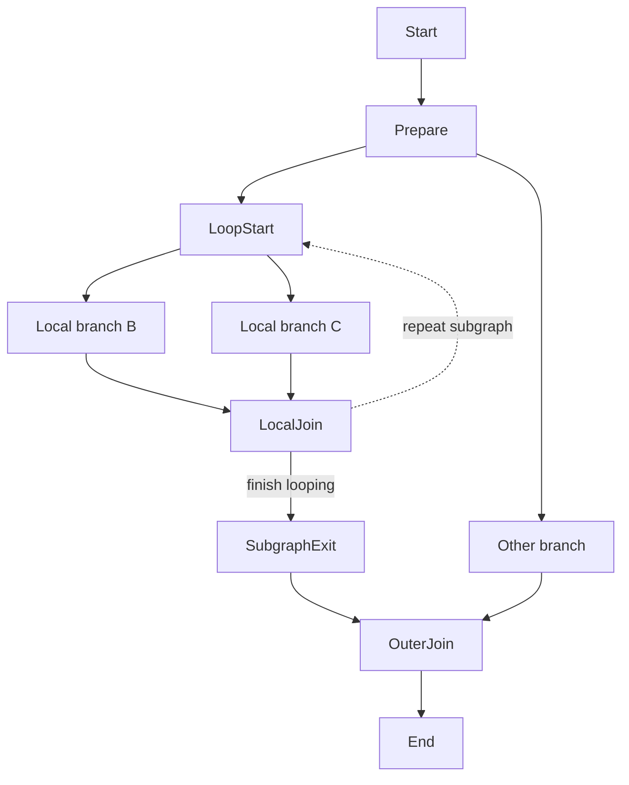

# Ariadne

Ariadne is a C++ graph-based pipeline and task scheduler. You define nodes, connect them with edges, and choose how many worker threads should execute the graph. Every node receives the same `std::shared_ptr<T>` state object and returns a string that tells the scheduler how to continue.

## Core concepts

- **Node** — A callable with the signature `std::string(std::shared_ptr<T>)`.
- **Normal edge** — Created with `addEdge()`. It contributes to the destination node's indegree and is used for ordinary flow and dependency tracking.
- **Cycle edge** — Created with `addCycleEdge()`. It represents an explicit jump or loop-back and does not contribute to indegree.
- **Worker** — A thread that takes scheduled tasks from the queue. It invokes a node's callable only when that node is active. Inactive nodes are still traversed for normal-edge bookkeeping, but their callables are skipped.
- **Shared state** — All nodes receive the same state object. Protect shared data yourself when multiple workers may access it concurrently.
- **`Start` and `End`** — These nodes are created automatically by `Graph<T>`; do not add them again.

## API reference

| API | Purpose |
|---|---|
| `Ariadne::Graph<T> graph` | Create a graph with an empty state pointer. |
| `Ariadne::Graph<T> graph(std::make_shared<T>())` | Create a graph with a shared state object. |
| `graph.addNode(name, callable)` | Register a node. The callable takes `std::shared_ptr<T>` and returns a `std::string`. |
| `graph.addEdge(from, to)` | Add a normal edge and increase the destination's indegree. |
| `graph.addCycleEdge(from, to)` | Add a cycle edge without increasing the destination's indegree. |
| `graph.print()` | Print the configured edges. |
| `graph.spawnWorker(count)` | Start the requested number of worker threads. |
| `graph.exec()` | Schedule execution from `Start`. Requires workers to have been started. |
| `graph.wait()` | Wait until the `End` node signals completion. |
| `graph.destroyWorker()` | Stop and join the worker threads. |

### Node return values and routing

A node's return value determines how the scheduler continues from that node:

| Return value | Meaning |
|---|---|
| `""` | Continue through all outgoing normal edges. This is the usual way to fan out into multiple branches. Cycle edges are not followed automatically. |
| A normal successor's name, such as `"Left"` | Make the selected normal successor active. Other normal successors are scheduled as inactive so the scheduler can still update indegrees through those paths without invoking their node callables. |
| A cycle successor's name, such as `"LoopStart"` | Take that cycle edge directly. Cycle edges bypass normal indegree checks. |

The returned name must identify a **direct successor of the current node**. It is not a general jump to any node in the graph. The current implementation does not safely handle a returned name that does not match an outgoing edge, so make sure that every returned destination is connected to the node.

### Conditional routing through a normal edge

For example, a node can choose between two outgoing normal edges:

```cpp
graph.addNode("Choose", [](std::shared_ptr<State> state) -> std::string
{
    return state->useLeft ? "Left" : "Right";
});

graph.addEdge("Choose", "Left");
graph.addEdge("Choose", "Right");
```

Treat returning `"Left"` as choosing the `Left` branch, and returning `"Right"` as choosing the `Right` branch. Non-selected branches are still traversed internally: inactive nodes skip their callables and pass their inactive status through normal successors, while the scheduler continues decrementing indegrees. This allows downstream joins to be released after all normal incoming dependencies have been accounted for.

When multiple normal incoming paths reach the same node, its active status is accumulated across those paths: the node becomes active if at least one incoming path is active. Therefore, a join shared by the selected and non-selected branches can still run when the selected path reaches it, while a node reached only by inactive paths remains inactive. This describes the active-state behavior implemented by the current scheduler.

## Important: add all nodes before adding edges

**Register every node before creating any edges.** For example:

```cpp
graph.addNode("A", nodeA);
graph.addNode("B", nodeB);
graph.addNode("C", nodeC);

graph.addEdge("A", "B");
graph.addEdge("A", "C");
```

Adding a node after edges have already been added marks the adjacency structure as uninitialized. When another edge is subsequently added, the current implementation rebuilds the adjacency structure, which discards the edges that were previously registered. If you add a node after defining edges, you must add **all edges again**. Also, `addNode()` is not a safe way to replace an existing node: use unique node names and configure the graph in this order:

1. Add every node.
2. Add every normal and cycle edge.
3. Print or inspect the graph.
4. Start workers and execute.

Do not mutate the graph while it is executing.

## Cycle edges and subgraphs

A cycle does **not** have to return only after the entire larger graph has joined. The synchronization point only needs to cover the branches whose completion is required before that particular cycle repeats.

For example, a loop can be contained inside a subgraph. Its local branches join at `LocalJoin`, and `LocalJoin` can loop back to `LoopStart`. An unrelated branch in the larger graph does not have to join at `LocalJoin`; it can meet the subgraph later at an outer join when the subgraph finally exits.



The corresponding edge structure is:

```cpp
graph.addEdge(graph.START, "Prepare");
graph.addEdge("Prepare", "LoopStart");
graph.addEdge("Prepare", "Other");
graph.addEdge("LoopStart", "B");
graph.addEdge("LoopStart", "C");
graph.addEdge("B", "LocalJoin");
graph.addEdge("C", "LocalJoin");
graph.addEdge("LocalJoin", "SubgraphExit");
graph.addCycleEdge("LocalJoin", "LoopStart");
graph.addEdge("SubgraphExit", "OuterJoin");
graph.addEdge("Other", "OuterJoin");
graph.addEdge("OuterJoin", graph.END);
```

At `LocalJoin`, return `"LoopStart"` to take the cycle edge for another iteration, or return `"SubgraphExit"` when the subgraph is finished. **The join must be reached before starting the next iteration whenever multiple branches from that loop iteration must finish first.** The outer join is only needed if the larger graph must wait for both the subgraph and `Other` before proceeding. A cycle edge itself does not wait for unrelated branches elsewhere in the graph, so only the branches that must complete before the loop repeats need to converge at the local join.

## Complete example: branch, join, and loop

This example splits into `B` and `C`. Both branches feed `Join`, which decides whether to repeat the subgraph or finish at `End`.

```cpp
#include <iostream>
#include <memory>
#include <string>
#include "Ariadne.h" // Replace with the actual header filename.

struct State
{
    int round = 0;
};

int main()
{
    Ariadne::Graph<State> graph(std::make_shared<State>());

    graph.addNode("A", [](std::shared_ptr<State>) -> std::string
    {
        std::cout << "A: split branches\n";
        return ""; // Schedule both normal branches: B and C.
    });

    graph.addNode("B", [](std::shared_ptr<State>) -> std::string
    {
        std::cout << "B: work\n";
        return "";
    });

    graph.addNode("C", [](std::shared_ptr<State>) -> std::string
    {
        std::cout << "C: work\n";
        return "";
    });

    graph.addNode("Join", [](std::shared_ptr<State> state) -> std::string
    {
        ++state->round;
        std::cout << "Join: round " << state->round << '\n';

        if (state->round < 3)
            return "A";   // Take the cycle edge Join -> A.

        return "End";     // Take the normal edge Join -> End.
    });

    // Register every node before adding any edges.
    graph.addEdge(graph.START, "A");
    graph.addEdge("A", "B");
    graph.addEdge("A", "C");
    graph.addEdge("B", "Join");
    graph.addEdge("C", "Join");
    graph.addEdge("Join", graph.END);
    graph.addCycleEdge("Join", "A");

    graph.print();

    graph.spawnWorker(3);
    graph.exec();
    graph.wait();
    graph.destroyWorker();
}
```

`Join` is released only after both `B` and `C` have satisfied its normal incoming dependencies. Returning `"A"` takes the cycle edge and begins another iteration; returning `"End"` takes the normal edge and finishes the graph. Because the branches join before the cycle is taken, the next iteration does not begin before both branches from the previous iteration have reached `Join`.

## Build and execution notes

The code uses `std::thread`, `std::mutex`, and `std::condition_variable`. Compile with a toolchain that supports the language features used by the header (C++20 is a reasonable baseline for the shown `static constexpr std::string` members) and enable the platform's thread support, such as `-pthread` with GCC or Clang on platforms that require it.

A typical lifecycle is:

```cpp
graph.spawnWorker(3);
graph.exec();
graph.wait();
graph.destroyWorker();
```

`wait()` depends on execution reaching `End` and calling its completion handler. A graph that loops forever, or whose selected route cannot reach `End`, will not finish waiting.

## Current implementation caveats

- **Shared state is not automatically synchronized.** If multiple node callables access the same state fields concurrently, provide suitable synchronization yourself.
- **Task-queue synchronization needs review.** `exec()` calls `pushTask()` without holding `tasksLock`, while workers access the queue under that mutex. Queue operations should consistently use the same synchronization mechanism.
- **Conditional routing is bookkeeping-aware.** A non-selected branch is still traversed to update dependency counts, but its node callables are skipped while inactive. At a join, active status is accumulated across incoming paths, so the join runs if at least one incoming path is active.
- **Large adjacency lists:** The code uses `std::lower_bound()` when an adjacency list has at least 100 entries, but does not guarantee that list is sorted by destination node ID. `lower_bound()` requires sorted data, so this lookup can fail unless the list is sorted first or a different search is used.
- **Invalid routes:** Returning a name that is not an outgoing edge can lead to invalid iterator access. Return only valid direct-successor names.
